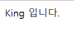

# 부모 - 자식 컴포넌트 데이터 전송

Vue는 단방향 데이터 전송이다.

props 를 이용하여 데이터를 전송할 수 있다.

```html
<html>
    <body>
        
        <div id="app1">
            <child-component :card-type="cardType"></child-component> <!-- (1) -->
        </div>

        <script src="https://cdn.jsdelivr.net/npm/vue@2.5.2/dist/vue.js"></script>
        <script>

            //자식 컴포넌트
            var childComponent = {
                template: '<div>{{cardType}} 입니다.</div>', /* (3) */
                props: ['cardType'] /* (2) */
            };

            //부모 컴포넌트
            new Vue({
                el: '#app1',
                data: {
                    cardType: "King"
                },
                components: {
                    'child-component': childComponent
                }
            });

        </script>
    </body>
</html>
```

(1) : 부모의 `cardType` 을 자식의 `card-type` 으로 보낸다.  
(2) : 부모의 `cardType` 을 받는다. **data** 처럼 사용 가능.  
(3) : `cardType` 을 사용.  

&nbsp;

**결과**

